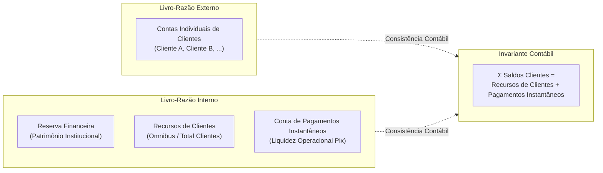
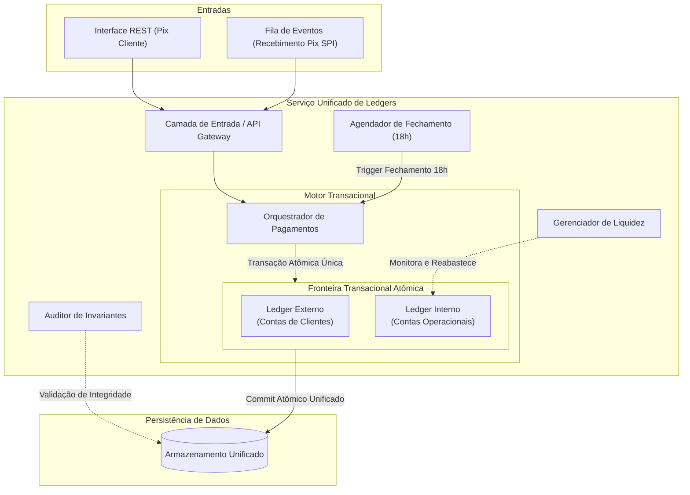
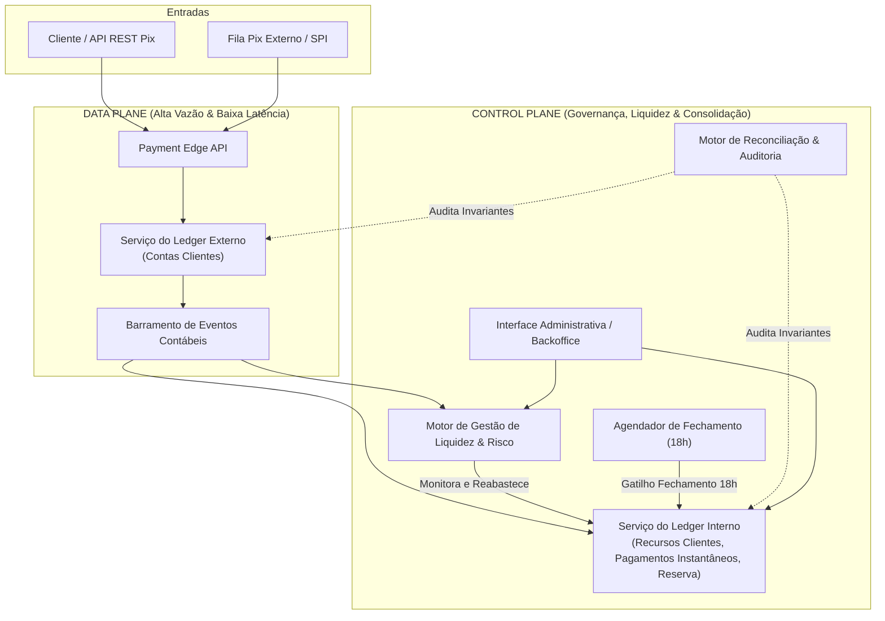

# 02 Proposta de Arquitetura

Este documento apresenta duas propostas arquiteturais de alto nível para o gerenciamento dos livros-razão (ledgers) de clientes e contas operacionais internas, atendendo a todos os requisitos de integridade contábil, alta disponibilidade e gestão de liquidez.

---

## 1. Modelo Contábil e Regras de Negócio

### 1.1. Estrutura de Contas e Dupla Entrada (_Double-Entry_)

Todas as movimentações em ambos os ledgers respeitam a regra de conservação de valor: cada operação consiste em débitos e créditos de igual valor.

- **Livro-Razão Externo (Clientes)**:
  - Contas individuais de cada cliente.
  - Registra débitos (envio Pix) e créditos (recebimento Pix / aportes).
- **Livro-Razão Interno (Operacional)**:
  - **Recursos de Clientes (Omnibus)**: Representa o total agregado de saldo sob custódia da instituição.
  - **Conta de Pagamentos Instantâneos**: Conta operacional de liquidação conectada à rede de pagamentos instantâneos (ex.: SPI/Bacen). Apenas saídas Pix consomem esta conta.
  - **Reserva Financeira**: Recursos próprios da instituição (capital de giro/colchão de segurança).

### 1.2. Invariantes Fundamentais

1. **Conservação de Valor**: $\sum \text{Débitos} = \sum \text{Créditos}$ em qualquer transação.
2. **Equivalência Patrimonial**:
   $$\sum \text{Saldos dos Clientes (Ledger Externo)} = \text{Saldo(Recursos de Clientes)} + \text{Saldo(Conta Pagamentos Instantâneos)}$$
3. **Reconciliação Fechamento Diário (18:00 BRT)**:
   $$\text{Saldo(Recursos de Clientes)} = \sum \text{Saldos dos Clientes (Ledger Externo)}$$
   $$\text{Saldo(Conta Pagamentos Instantâneos)} = 0 \quad (\text{ou valor base de recomposição acordado})$$

---

## 2. Política de Gestão de Liquidez e Reabastecimento

Para garantir que **nenhum cliente enfrente falhas no Pix por indisponibilidade de fundos na conta de liquidação**:

### 2.1. Estratégia de Provisionamento e Limiares (_Watermarks_)

- **Colchão Operacional Dinâmico ($L_{\text{alvo}}$)**: Calculado com base no volume histórico ponderado de transações para a janela de tempo.
- **Limiar Mínimo ($L_{\text{mín}}$ - Gatilho de Reabastecimento)**: Quando o saldo da _Conta de Pagamentos Instantâneos_ atinge $L_{\text{mín}}$, um evento de transferência interna é disparado automaticamente:
  $$\text{Débito: Recursos de Clientes} \longrightarrow \text{Crédito: Conta de Pagamentos Instantâneos}$$
- **Fallback de Emergência**: Caso o saldo em _Recursos de Clientes_ não seja suficiente ou esteja temporariamente bloqueado, a _Reserva Financeira_ cobre a diferença através de um empréstimo operacional interno.

### 2.2. Fluxo de Liquidação Contínua vs. Sweeping às 18h

- **Durante o dia (Regime Contínuo)**:
  - **Pix Outgoing (Envio)**: Débito na conta individual do cliente no Ledger Externo $\rightarrow$ Débito na _Conta de Pagamentos Instantâneos_ no Ledger Interno.
  - **Pix Incoming (Recebimento)**: Crédito na conta individual do cliente no Ledger Externo $\rightarrow$ Crédito na _Conta de Pagamentos Instantâneos_ (ou diretamente em _Recursos de Clientes_) no Ledger Interno.
- **Rotina das 18h BRT (_Daily Sweeping & Rebalance_)**:
  - Uma rotina agendada congela a janela contábil do dia comercial.
  - Totaliza o saldo do Ledger Externo.
  - Executa a transferência de ajuste (_sweep_) entre _Conta de Pagamentos Instantâneos_ e _Recursos de Clientes_, igualando `Recursos de Clientes` exatamente ao total de saldos dos clientes.

---

## 3. Cenário 1: Arquitetura Co-localizada (Mesmo Serviço e Instâncias)

Neste cenário, os dois livros-razão (Externo e Interno) e a lógica de orquestração operam dentro do mesmo limite de serviço e compartilham as instâncias de processamento.

### 3.1. Características e Funcionamento

- **Transação Atômica Única**: As movimentações no Ledger Externo (contas individuais de clientes) e no Ledger Interno (contas operacionais como Conta de Pagamentos Instantâneos) são executadas sob uma **única transação atômica**. Dessa forma, a efetivação do Pix para o cliente e o reflexo contábil interno ocorrem de forma indivisível (ambos são confirmados ou revertidos em conjunto), eliminando divergências intermediárias entre os dois livros-razão.
- **Gerenciamento de Liquidez**: O módulo `LiquidityMgr` monitora as contas operacionais no ledger interno e dispara lançamentos de reabastecimento sempre que o saldo da Conta de Pagamentos Instantâneos atingir o limite mínimo seguro.
- **Reconciliação das 18h**: Rotinas agendadas executam o fechamento diário, efetuando o ajuste de saldo (_sweep_) entre a Conta de Pagamentos Instantâneos e Recursos de Clientes.

### 3.2. Vantagens

- **Consistência Imediata**: Eliminação de estados transitórios inconsistentes entre clientes e contas internas graças à transação atômica unificada.
- **Simplicidade Operacional**: Menor complexidade de implantação e monitoramento, sem necessidade de orquestração assíncrona distribuída para o acoplamento entre ledgers.
- **Facilidade de Rastreabilidade**: Fluxo transacional coeso com auditoria centralizada.

### 3.3. Desvantagens e Trade-offs

- **Acoplamento Operacional**: O alto volume de transações de clientes compartilha os mesmos recursos computacionais e transacionais da contabilidade interna e dos relatórios.
- **Escala Monolítica**: A escalabilidade do caminho crítico do Pix fica vinculada à capacidade da fronteira transacional unificada do serviço.
- **Risco de Contenção**: Picos de requisições de clientes podem concorrer com as rotinas de fechamento diário e auditoria.

---

## 4. Cenário 2: Arquitetura Segregada (Data Plane vs. Control Plane)

Neste cenário, a arquitetura é desacoplada em duas camadas com responsabilidades e características operacionais distintas:

- **Data Plane (Plano de Dados)**: Focado em baixíssima latência, altíssima vazão e resiliência para o fluxo crítico de pagamentos.
- **Control Plane (Plano de Controle)**: Focado em conformidade, consolidação contábil profunda, governança de liquidez e reconciliação.

### 4.1. Características e Funcionamento

- **Caminho Crítico Isolado (Data Plane)**:
  - O _Ledger Externo_ atende diretamente o cliente final com latência mínima, valida o saldo local e cria transferências sem dependência síncrona com contas institucionais.
  - Toda operação realizada no Data Plane emite imediatamente um evento no barramento assíncrono e comunica-se com a rede liquidante (SPI).
- **Consistência Eventual e Gestão de Liquidez (Control Plane)**:
  - O _Ledger Interno_ consolida os eventos e atualiza as contas institucionais (_Recursos de Clientes_, _Conta de Pagamentos Instantâneos_, _Reserva Financeira_).
  - O _LiquidityEngine_ monitora o saldo da Conta de Pagamentos Instantâneos continuamente de forma proativa. Se o saldo projetado atingir o limiar mínimo de segurança, dispara a recomposição de liquidez diretamente no Ledger Interno.
- **Operação das 18h BRT**:
  - O _SweepScheduler_ no Control Plane inicia a janela de corte contábil.
  - O _ReconciliationEngine_ valida a invariante global comparando os snapshots de ambos os planos.
  - O saldo excedente ou deficitário da _Conta de Pagamentos Instantâneos_ é transferido para _Recursos de Clientes_, zerando divergências transitórias.

### 4.2. Vantagens

- **Alta Disponibilidade e Resiliência**: Falhas temporárias ou lentidão no Control Plane (ex.: processamento pesado de relatórios ou lentidão contábil) não impedem os clientes de transacionarem Pix no Data Plane.
- **Escalabilidade Independente**: O Data Plane pode ser escalado horizontalmente de forma elástica para suportar eventos de tráfego extremo (ex.: datas comerciais de alto volume).
- **Isolamento de Segurança e Auditoria**: O Control Plane e as contas mestres (_Reserva Financeira_) ficam isolados de acesso direto por requisições de clientes.

### 4.3. Desvantagens e Trade-offs

- **Complexidade de Orquestração**: Exige barramento de eventos robusto, garantia de entrega _at-least-once_ e tratamento rigoroso de idempotência no consumidor contábil.
- **Consistência Eventual Explícita**: Existe uma janela de tempo (milissegundos a segundos) em que o estado consolidado do Ledger Interno reflete as operações do Data Plane de forma assíncrona.

---

## 5. Especificação das Interfaces e Operações Internas

Independentemente da opção de implantação, as seguintes interfaces e rotinas operacionais devem existir:

### 5.1. Interfaces Expostas (Alto Nível)

| Interface                               | Tipo / Protocolo          | Plano / Domínio         | Responsabilidade                                                                                     |
| :-------------------------------------- | :------------------------ | :---------------------- | :--------------------------------------------------------------------------------------------------- |
| **Transações Pix Cliente**              | REST / Event-Driven       | Externo (Data Plane)    | Recebe ordens de envio de Pix e webhooks/eventos de recebimento externo.                             |
| **Gestão de Liquidez Interna**          | Mensageria / RPC Interno  | Interno (Control Plane) | Dispara ordens de reabastecimento (`Recursos de Clientes` $\rightarrow$ `Pagamentos Instantâneos`).  |
| **Gatilho de Reconciliação / Sweep**    | Job Agendado / Evento     | Control Plane           | Executa a rotina diária das 18h BRT para igualar os saldos e emitir relatório de auditoria.          |
| **Painel Administrativo & Operacional** | Web Dashboard / API Admin | Interno (Backoffice)    | Visualização em tempo real de saldos, posição de liquidez, alertas de invariantes e aportes manuais. |

### 5.2. Rotinas e Automações Operacionais

1. **Reabastecimento Preditivo / Reativo (Gatilho Automático)**:
   - Monitoramento contínuo do saldo da Conta de Pagamentos Instantâneos.
   - Disparo automático de transferência de lote de liquidez sempre que $\text{Saldo} < L_{\text{mín}}$.
2. **Fechamento Diário das 18:00 BRT (Job Agendado)**:
   - Coleta o somatório dos saldos individuais no Ledger de Clientes.
   - Realiza o _sweep_ entre `Pagamentos Instantâneos` e `Recursos de Clientes`.
   - Gera o _snapshot_ de fechamento contábil e emite relatório de conformidade.
3. **Sentinela de Invariantes (Auditor Contínuo de Segundo Plano)**:
   - Executa periodicamente a checagem da fórmula:
     $$\Delta \text{Ledger Externo} = \Delta \text{Recursos de Clientes} + \Delta \text{Pagamentos Instantâneos}$$
   - Dispara alarmes imediatos para a equipe de engenharia/operações em caso de qualquer anomalia contábil.

---

## 6. Comparativo e Matriz de Decisão

| Critério                        | Cenário 1: Co-localizado (Monolítico)                                                | Cenário 2: Segregado (Data Plane vs. Control Plane)                                                          |
| :------------------------------ | :----------------------------------------------------------------------------------- | :----------------------------------------------------------------------------------------------------------- |
| **Complexidade de Arquitetura** | **Baixa**: Poucos componentes e menor sobrecarga de infraestrutura.                  | **Moderada a Alta**: Requer barramentos de eventos e contratos assíncronos.                                  |
| **Resiliência a Falhas**        | **Média**: Falha no serviço afeta tanto operações de clientes quanto gestão interna. | **Alta**: Falhas na gestão interna não afetam a capacidade do cliente de transacionar.                       |
| **Escalabilidade**              | **Limitada**: Escalar o fluxo Pix exige escalar a lógica contábil inteira.           | **Excelente**: Data Plane e Control Plane escalam de forma totalmente desacoplada.                           |
| **Latência no Caminho Crítico** | **Baixa**: Execução local sem múltiplos saltos de rede.                              | **Mínima no Cliente**: O cliente recebe resposta imediata enquanto o plano de controle processa em paralelo. |
| **Governança e Auditoria**      | Centralizada, porém sujeita a concorrência de recursos.                              | Isolada, auditável por design e protegida contra sobrecarga operacional.                                     |

### Recomendação

- Para um estágio inicial ou ambientes com volume moderado, o **Cenário 1** oferece implementação ágil e menor custo operacional.
- Para uma instituição financeira em expansão com SLA rigoroso de Pix (onde indisponibilidade de pagamentos é inaceitável) e necessidade de conformidade regulatória estrita, o **Cenário 2 (Data Plane / Control Plane)** é a abordagem recomendada pela indústria por isolar o risco operacional e garantir escalabilidade independente.

---

## Documentos Relacionados

- [03 - Detalhamento Técnico do Cenário 2 (Data Plane vs Control Plane)](03-detalhamento-cenario-2.md)
- [04 - Considerações Arquiteturais, Alternativas e Evoluções Futuras](04-considerações.md)
- [Modelagem DDL do Banco de Dados (schema.sql)](schema.sql)
