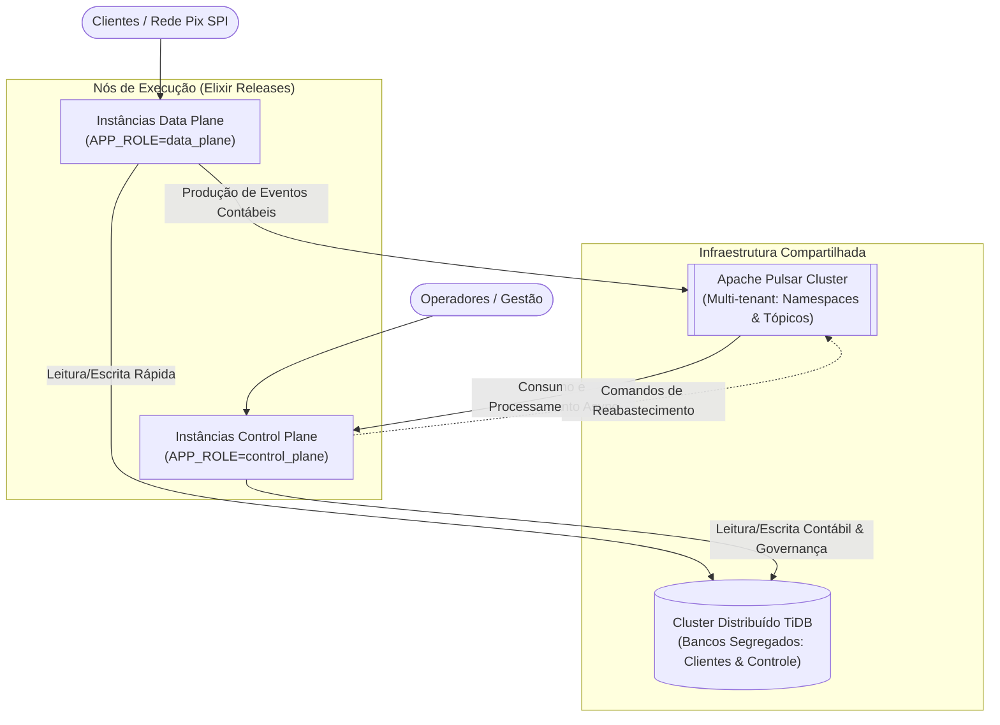
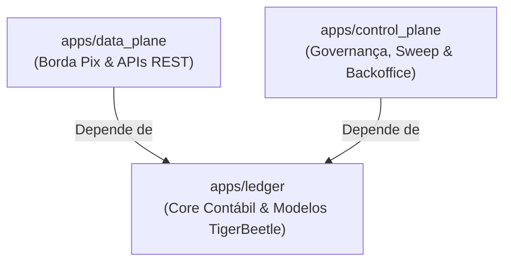
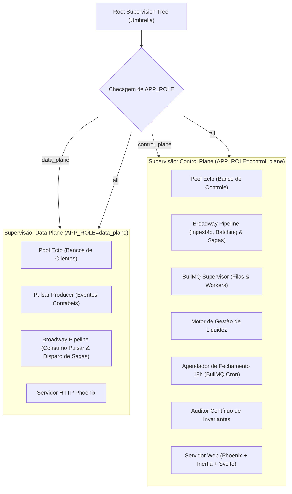
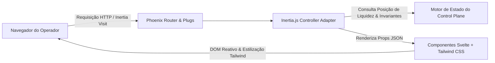
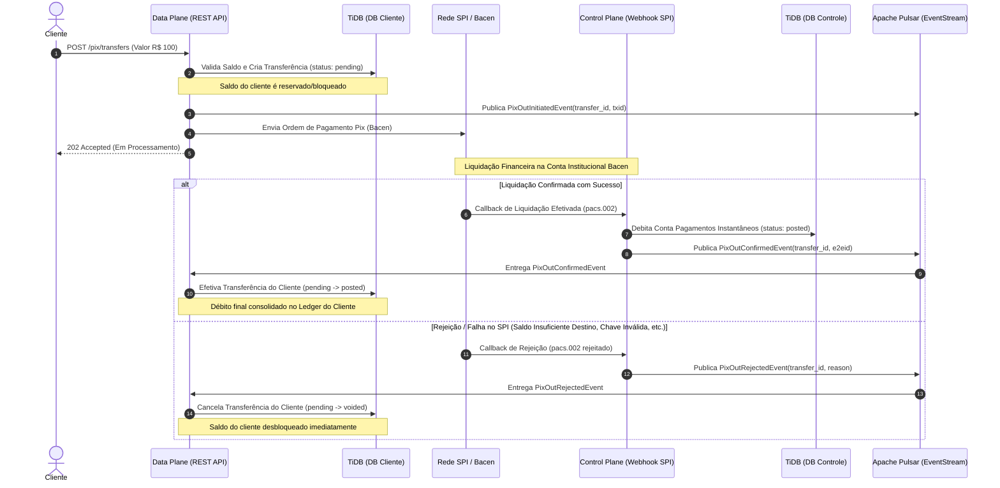
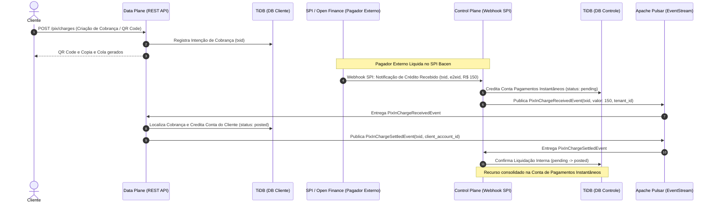
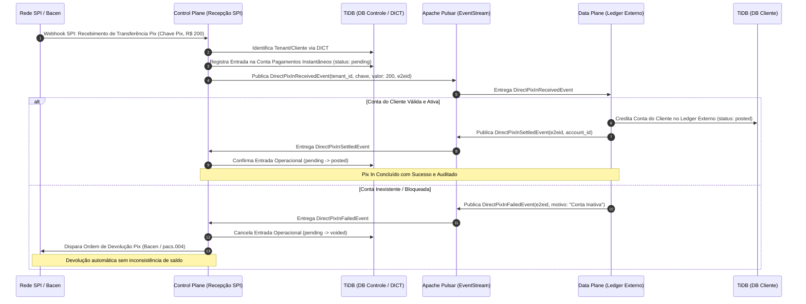
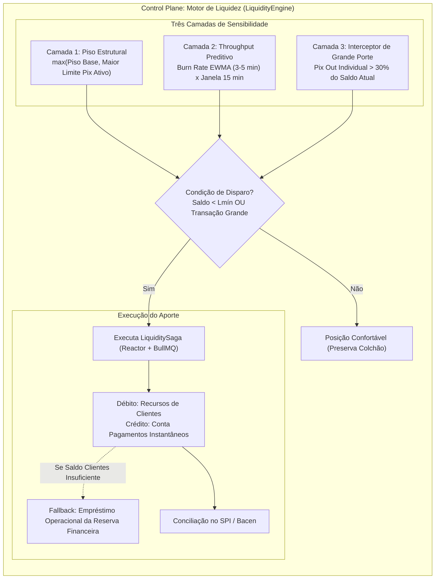
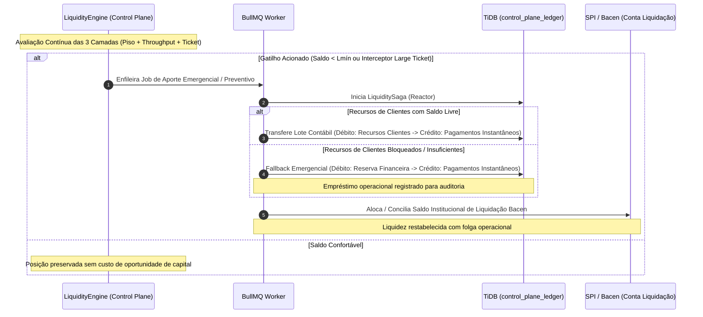

# 03 Detalhamento Técnico

Este documento aprofunda a implementação técnica da arquitetura segregada (**Cenário 2**) descrita na [proposta de arquitetura](proposta-arquitetura.md). São detalhados a estrutura do projeto em Elixir (_Umbrella Application_), o desacoplamento por variáveis de ambiente, a topologia de dados no TiDB, a mensageria multi-tenant no Apache Pulsar, a interface de gestão (_backoffice_) e a fundação contábil inspirada no modelo do TigerBeetle.

---

## 1. Visão Geral e Pilares Arquiteturais

A separação em **Data Plane** e **Control Plane** visa atingir:

1. **Isolamento de Caminho Crítico**: O cliente final e o SPI (Pix Bacen) transacionam no _Data Plane_ com latência mínima (<10ms) e sem bloqueios contábeis globais.
2. **Escalabilidade Elástica Independente**: Instâncias do _Data Plane_ escalam horizontalmente sob demanda transacional de clientes; instâncias do _Control Plane_ operam no ritmo da governança, consolidação e auditoria.
3. **Resiliência a Falhas**: Indisponibilidade de rotinas contábeis pesadas, relatórios ou conciliação no _Control Plane_ não interrompe o fluxo de pagamentos instantâneos.



---

## 2. Stack Tecnológica e Racional de Escolha

| Componente                         | Tecnologia                             | Papel no Sistema                                 | Justificativa Técnica                                                                                                                                                                                                                                     |
| :--------------------------------- | :------------------------------------- | :----------------------------------------------- | :-------------------------------------------------------------------------------------------------------------------------------------------------------------------------------------------------------------------------------------------------------- |
| **Linguagem & Runtime**            | **Elixir / Erlang OTP (BEAM)**         | Base da aplicação (Core, APIs, Consumers)        | Concorrência massiva por processos leves (atores isolados), tolerância a falhas via _Supervision Trees_, ausência de _stop-the-world GC_ global e alta previsibilidade de latência (soft real-time).                                                      |
| **Persistência de Dados**          | **TiDB (PingCAP)**                     | Banco de dados transacional distribuído          | Compatível com MySQL/Ecto, consistência estrita (ACID com Raft), particionamento horizontal transparente e isolamento lógico multitenant via esquemas/databases segregados no mesmo cluster.                                                              |
| **Mensageria & Streaming**         | **Apache Pulsar**                      | Barramento de eventos e comandos contábeis       | Suporte nativo a _Multi-Tenancy_ (Tenants/Namespaces), arquitetura desacoplada de computação e armazenamento (Brokers + Apache BookKeeper), garantia de ordem por chave (_key-shared_), e alta durabilidade com _fencing_.                                |
| **Processamento de Mensagens**     | **Broadway (Elixir)**                  | Pipelines de ingestão e consumo de dados         | Gerenciamento automático de _backpressure_, particionamento e processamento em lote (_batching_), concorrência por estágios e gestão nativa de confirmações (_ack/nack_) contra o Apache Pulsar.                                                          |
| **Orquestração de Sagas & Fluxos** | **Reactor (Ash Framework)**            | Coordenação declarativa de etapas e compensações | Execução orientada a grafos acíclicos dirigidos (DAG) de cada etapa (_step_) do fluxo transacional, garantindo o padrão Saga com reversões automáticas (_undo/compensation_) caso ocorra erro em qualquer fase (ex.: estorno de `pending` para `voided`). |
| **Background Jobs & Filas**        | **BullMQ (Elixir Port)**               | Gerenciamento de tarefas em segundo plano e cron | Suporte a filas distribuídas, jobs com atraso (_delayed_), agendamento recorrente (ex.: _sweep_ das 18h), retries com backoff exponencial, priorização de tarefas e controle de concorrência.                                                             |
| **Frontend / Backoffice**          | **Svelte + Inertia.js + Tailwind CSS** | Interface de gestão, monitoramento e operação    | SPA moderna e altamente reativa (Svelte) sem overhead de manter APIs GraphQL/REST paralelas, utilizando roteamento direto do Phoenix (Inertia.js) e estilização consistente (Tailwind).                                                                   |

---

## 3. Estrutura do Projeto: Elixir Umbrella Application

A base de código é organizada como uma aplicação _Umbrella_, permitindo compartilhar bibliotecas de domínio mantendo fronteiras nítidas de dependência e compilação:

```
cumbuca/
├── mix.exs                             # Umbrella root
├── config/
│   ├── config.exs                      # Configuração compartilhada
│   ├── dev.exs
│   ├── test.exs
│   └── runtime.exs                     # Carregamento dinâmico baseado em APP_ROLE
├── apps/
│   ├── ledger/                         # [CORE] Domínio contábil puro e abstrações
│   │   ├── mix.exs
│   │   └── lib/
│   │       ├── ledger.ex               # API pública de dupla entrada
│   │       ├── ledger/
│   │       │   ├── models/             # Schemas inspirados no TigerBeetle
│   │       │   │   ├── ledger.ex
│   │       │   │   ├── account.ex
│   │       │   │   ├── balance.ex
│   │       │   │   ├── transfer.ex
│   │       │   │   ├── account_code.ex
│   │       │   │   └── transfer_code.ex
│   │       │   ├── steps/              # Steps atômicos reutilizáveis para o Reactor
│   │       │   │   ├── lock_account_step.ex
│   │       │   │   ├── create_transfer_step.ex
│   │       │   │   └── settle_transfer_step.ex
│   │       │   ├── engine.ex           # Regras de débitos/créditos e invariantes
│   │       │   └── repo.ex             # Ecto Repo adaptável dinamicamente
│   │
│   ├── data_plane/                     # [DATA PLANE] APIs críticas e mensageria
│   │   ├── mix.exs
│   │   └── lib/
│   │       ├── data_plane.ex
│   │       ├── data_plane/
│   │       │   ├── application.ex      # Supervisor condicional da role data_plane
│   │       │   ├── broadway.ex         # Pipeline Broadway para consumo de eventos Pulsar
│   │       │   ├── producer.ex         # Pulsar producer para eventos contábeis
│   │       │   ├── sagas/              # Sagas locais via Reactor
│   │       │   │   └── pix_out_saga.ex # Saga de envio: validação, reserva e submissão SPI
│   │       │   └── web/                # Endpoints REST (Pix envio / webhooks SPI)
│   │               ├── router.ex
│   │               └── controllers/
│   │
│   └── control_plane/                  # [CONTROL PLANE] Governança, Backoffice & Sweep
│       ├── mix.exs
│       ├── assets/                     # Frontend Svelte + Tailwind + Inertia
│       │   ├── js/
│       │   │   ├── app.js
│       │   │   └── pages/              # Páginas Svelte do Backoffice
│       │   └── css/app.css
│       └── lib/
│           ├── control_plane.ex
│           ├── control_plane/
│           │   ├── application.ex      # Supervisor condicional da role control_plane
│           │   ├── broadway.ex         # Pipeline Broadway para processamento em lote
│           │   ├── consumer.ex         # Pulsar consumer para eventos contábeis
│           │   ├── workers/            # Background Jobs & Workers via BullMQ
│           │   │   ├── sweep_worker.ex # Job agendado para o sweep das 18h
│           │   │   └── audit_worker.ex # Job periódico de verificação de invariantes
│           │   ├── sagas/              # Sagas de governança via Reactor
│           │   │   ├── sweep_saga.ex   # Saga de fechamento contábil das 18h
│           │   │   └── pix_settle_saga.ex # Saga de confirmação e conciliação SPI
│           │   ├── tenants/            # Gestão e catálogo de tenants/customers
│           │   │   ├── tenant.ex       # Schema com referência ao data plane ledger
│           │   │   └── provisioner.ex  # Orquestrador de novos databases no TiDB
│           │   ├── liquidity_engine.ex # Monitoramento e disparo de aportes
│           │   ├── sweep_scheduler.ex  # Agendador de filas do BullMQ (18h BRT)
│           │   ├── reconciler.ex       # Verificação periódica de invariantes globais
│           │   └── web/                # Phoenix + Inertia Controller
│                   ├── router.ex
│                   └── controllers/
```

### 3.1. Relação de Dependência entre Apps



- **`ledger`** não conhece rede, transporte ou mensageria; contém apenas regras de negócio contábeis puras, validações de integridade e mapeamento de dados.
- **`data_plane`** e **`control_plane`** dependem de `ledger`, garantindo que toda gravação e leitura contábil respeite as mesmas regras sem duplicação de lógica.

---

## 4. Determinação de Papel por Variável de Ambiente (`APP_ROLE`)

A aplicação é empacotada em uma única _release_ executável. A inicialização dos subsistemas é controlada pela variável de ambiente `APP_ROLE`:

- `APP_ROLE=data_plane`: Inicia apenas os processos necessários para receber pagamentos e emitir eventos.
- `APP_ROLE=control_plane`: Inicia os consumidores do Pulsar, o agendador de _sweep_, os motores de liquidez e o servidor web do _backoffice_.
- `APP_ROLE=all` (ou não informada em desenvolvimento): Inicializa ambos os planos para facilitar desenvolvimento e testes locais.

### 4.1. Árvore de Supervisão Condicional



---

## 5. Fundamentação do Modelo Contábil (Inspirado no TigerBeetle)

O app `ledger` adota primitivas contábeis de alto desempenho e imutabilidade inspiradas no design do **TigerBeetle**:

### 5.1. Entidades Conceituais

1. **`ledgers`**:
   - Identifica o livro-razão e sua moeda/unidade base (ex.: BRL com precisão de centavos em inteiros `u64`).
   - Define se é um ledger de clientes ou o ledger de controle interno.
2. **`accounts`**:
   - Registro cadastral e atributos da conta (ID, ledger, cliente CPF/CNPJ, tipo de conta, flags e status). Desacoplada de saldos para eliminar contenção de linha (_row lock_) em operações cadastrais.
3. **`balances`**:
   - Tabela dedicada e particionada nativamente por `shard_id` (HASH no TiDB) para alta vazão de escrita paralela sem contenção entre nós TiKV:
     - `debits_pending`, `debits_posted`
     - `credits_pending`, `credits_posted`
     - `version`: Controle de concorrência otimista (Compare-And-Swap).
   - Saldo disponível calculado diretamente:

     $$\text{Saldo disponivel} = (\text{credits\_posted} - \text{debits\_posted}) - \text{debits\_pending}$$

4. **`transfers`**:
   - Registro imutável de movimentação financeira entre duas contas (`debit_account_id` $\rightarrow$ `credit_account_id`).
   - Implementa o ciclo de vida transacional em duas fases do TigerBeetle:
     - **`pending`**: Reserva e bloqueia saldo atômico (evita _double-spending_). Valores afetam `debits_pending` e `credits_pending`.
     - **`posted`**: Confirmação final e irrevogável da transferência pendente (`pending_id`), consolidando os valores em `debits_posted` e `credits_posted`.
     - **`voided`**: Cancelamento e reversão da transferência pendente (`pending_id`), liberando o saldo retido sem impacto contábil definitivo.
5. **`accounts_codes`**:
   - Dicionário padronizado que define o tipo e propósito da conta:
     - `1000..1999`: Contas de Clientes (Ledger Externo).
     - `2000`: Conta Recursos de Clientes (Omnibus agregada).
     - `2001`: Conta de Pagamentos Instantâneos (Liquidez Operacional Pix).
     - `3000`: Reserva Financeira (Patrimônio próprio institucional).
6. **`transfers_codes`**:
   - Classificação das operações de transferência:
     - `100`: Pix Outgoing (Envio de Pix por cliente).
     - `101`: Pix Incoming (Recebimento de Pix via SPI).
     - `200`: Aporte de Liquidez Pix (`Recursos de Clientes` $\rightarrow$ `Pagamentos Instantâneos`).
     - `201`: Aporte de Contingência (`Reserva Financeira` $\rightarrow$ `Pagamentos Instantâneos`).
     - `300`: Sweep Diário 18:00 BRT (Reconciliação e nivelamento de saldos).

### 5.2. Catálogo Central de Tenants / Customers (Control Plane)

No banco do _Control Plane_ (`control_plane_ledger`) reside a tabela mestra `tenants` (ou `customers`), responsável pelo cadastro e governança de cada cliente institucional/tenant da plataforma:

- **Campos Principais**:
  - `id` (UUID / chave primária)
  - `name` / `legal_name` (Identificação corporativa)
  - `status` (`active`, `suspended`, `provisioning`)
  - **`data_plane_ledger_id`**: Referência direta ao identificador do ledger contábil associado.
  - **`database_name`**: Nome do banco dedicado no cluster TiDB (`client_ledger_<tenant_id>`).
  - `created_at` / `updated_at`

- **Ciclo de Provisionamento**:
  - Quando um novo cliente/tenant é cadastrado via Backoffice ou API do _Control Plane_, o módulo `ControlPlane.Tenants.Provisioner` orquestra:
    1. A criação do novo schema/database dedicado no cluster TiDB (`client_ledger_<tenant_id>`).
    2. A execução das migrações contábeis iniciais do `apps/ledger` (tabelas no padrão TigerBeetle).
    3. A vinculação formal entre o `tenant_id` e o novo `data_plane_ledger_id` na tabela de controle.

- **Roteamento no Data Plane & Fechamento no Control Plane**:
  - **No Data Plane**: As requisições Pix do cliente são autenticadas identificando o tenant, permitindo ao pool Ecto direcionar a escrita para o banco `client_ledger_<tenant_id>` correspondente.
  - **No Control Plane**: O agendador de _sweep_ das 18h e o auditor de invariantes consultam a tabela `tenants` para iterar por todos os ledgers de clientes ativos, garantindo que a soma consolidada de todos os ledgers externos corresponda exatamente aos saldos de _Recursos de Clientes_ e _Pagamentos Instantâneos_.

---

## 6. Topologia de Dados e Multi-Tenancy

### 6.1. TiDB: Estratégia de Segregação de Bancos

O TiDB executa em um cluster unificado (aproveitando o motor de consenso Raft e escalabilidade do TiKV), com isolamento lógico de banco de dados:

- **Bancos de Ledgers Externos / Clientes**:
  - Padrão: `client_ledger_<tenant_id>`.
  - Contém as contas individuais de clientes e suas transferências locais.
  - Acessado primariamente pelo _Data Plane_.
- **Banco do Control Plane**:
  - Padrão: `control_plane_ledger`.
  - Contém a **tabela `tenants/customers`** com a referência para cada Data Plane Ledger (`data_plane_ledger_id`, `database_name`), além das contas mestres operacionais (_Recursos de Clientes_, _Pagamentos Instantâneos_, _Reserva Financeira_), configurações de limiares, logs de auditoria e consolidações do _sweep_.
  - Acessado exclusivamente pelo _Control Plane_.

### 6.2. Apache Pulsar: Topologia Multi-Tenant (`persistent://tenant/namespace/topic`)

Conforme a [especificação de Multi-Tenancy do Apache Pulsar](https://pulsar.apache.org/docs/next/concepts-multi-tenancy/), os tópicos são identificados por URLs canônicas com a seguinte estrutura:

$$\text{\textbf{persistent}}://\mathbf{tenant}/\mathbf{namespace}/\mathbf{topic}$$

- **`persistent://`**: Garante durabilidade contábil com persistência em disco distribuída via Apache BookKeeper (_fencing_, sem perda de mensagens).
- **`tenant`**: Identificador do cliente institucional (`tenant_id`), permitindo isolamento administrativo, alocação de cotas de armazenamento e segregação de credenciais.
- **`namespace`**: Unidade de configuração e agrupamento de políticas (permissões de acesso, _retention policies_, limites de _backlog_ e taxa de transferência).
- **`topic`**: Canal individual de mensagens com suporte a partições.

#### Mapeamento da Hierarquia de Tópicos:

```
persistent://
├── <tenant_id>/                                    # Identificador do Tenant cadastrado no Control Plane
│   ├── data_plane/                                 # Namespace gerenciado pelo Data Plane
│   │   └── pix-out-initiated                       # persistent://<tenant_id>/data_plane/pix-out-initiated
│   │
│   └── control_plane/                              # Namespace gerenciado pelo Control Plane
│       ├── pix-out-settled                         # persistent://<tenant_id>/control_plane/pix-out-settled
│       ├── pix-in-received                         # persistent://<tenant_id>/control_plane/pix-in-received
│       └── daily-sweep                             # persistent://<tenant_id>/control_plane/daily-sweep
```

#### Vantagens Operacionais do Modelo:

1. **Segregação Rigorosa e Segurança (RBAC)**: As instâncias de Data Plane operando em favor de um tenant recebem tokens JWT com escopo restrito ao caminho `persistent://<tenant_id>/...`, impedindo acesso acidental ou indevido a eventos de outros tenants.
2. **Políticas Granulares por Namespace**: O namespace `control_plane` pode ter políticas estritas de retenção longa para fins de auditoria, enquanto o namespace `data_plane` pode ser otimizado para expiração rápida após confirmação de entrega.
3. **Consumo Paralelo com Ordenação Garantida**: Utilização de assinaturas (_subscriptions_) do tipo **`Key_Shared`** com chave pelo `account_id` do cliente, assegurando que operações na mesma conta sejam processadas estritamente em ordem cronológica, mesmo com múltiplos consumidores ativos.

---

## 7. Arquitetura do Backoffice: Phoenix + Inertia.js + Svelte

O subsistema administrativo dentro de `apps/control_plane` expõe o portal operacional para a equipe financeira e de engenharia:



### Principais Módulos do Backoffice:

1. **Monitor de Liquidez em Tempo Real**: Exibição do nível atual da _Conta de Pagamentos Instantâneos_ em relação aos limiares mínimo ($L_{\text{mín}}$) e alvo ($L_{\text{alvo}}$).
2. **Sentinela de Invariantes**: Alertas visuais e painel contábil validando a conservação de valor:
   $$\sum \text{Saldos Clientes} = \text{Recursos de Clientes} + \text{Pagamentos Instantâneos}$$
3. **Controle de Fechamento Diário (18h)**: Acompanhamento da rotina de _sweep_, exibição do snapshot de encerramento contábil e botão de disparo manual para contingências.
4. **Injeção Manual de Liquidez**: Interface para aprovação e execução de transferências emergenciais originadas na _Reserva Financeira_.
5. **Gestão de Tenants & Provisionamento de Ledgers**: Cadastro de clientes institucionais/tenants, visualização do status dos Data Plane Ledgers associados (`client_ledger_<tenant_id>`) e orquestração de provisionamento de novos bancos no cluster TiDB.

---

## 8. Ciclo de Vida Operacional e Fluxos Integrados

### 8.0. Dinâmica Transacional: Reactor (Sagas) e Broadway (Pipelines)

A robustez do fluxo transacional apoia-se na sinergia entre **Broadway** e **Reactor**:

1. **Elixir Broadway (Ingestão Concorrente & Backpressure)**:
   - Atua como a camada de transporte e consumo resiliente do Apache Pulsar.
   - Aplica particionamento, controle dinâmico de taxa (_rate limiting/backpressure_), agregação em lotes (_batching_) e confirmações determinísticas de entrega (_ack/nack_).
2. **Reactor / Ash Framework (Orquestração de Sagas & Steps)**:
   - Modela cada fluxo de negócio como um grafo declarativo de etapas (**Steps**).
   - Gerencia o ciclo de vida contábil em duas fases do **TigerBeetle**:
     - **`pending`**: Step de reserva atômica de saldo (impede _double-spending_).
     - **`posted`**: Step de confirmação e consolidação definitiva da liquidação.
     - **`voided`**: Compensação automática da Saga caso algum step intermediário falhe (desbloqueia o saldo retido de forma transparente).

---

### 8.1. Fluxo de Pix Out (Envio de Pix por Cliente)

O cliente inicia o Pix no **Data Plane**, que executa a Saga via **Reactor** para reservar o saldo como `pending` e submeter ao SPI. A liquidação institucional bate no **Control Plane**, cuja pipeline **Broadway** processa o retorno do SPI e emite o evento de consolidação para o Data Plane:



---

### 8.2. Fluxo de Pix In via QR Code / Cobrança (Open Finance / SPI)

Na cobrança Pix, o QR Code é gerado na borda (**Data Plane**), o pagador quita externamente, a liquidação institucional entra pelo **Control Plane**, e o crédito é efetivado no cliente via evento assíncrono:



---

### 8.3. Fluxo de Pix In Direto (Transferência via Chave Pix ou Dados Bancários)

Quando uma transferência é enviada de fora diretamente para uma chave Pix ou conta, o **Control Plane** recebe a liquidação no SPI, identifica o tenant de destino e despacha o crédito para o **Data Plane**:



---

### 8.4. Política de Reabastecimento de Liquidez: Regra Composta em Três Camadas

Para garantir o **Requisito 1** (_"Nenhum cliente nunca deveria ver falhas no Pix por indisponibilidade na Conta de Pagamentos Instantâneos"_) sem reter capital ocioso desnecessário na conta de liquidação do Bacen, o `LiquidityEngine` no **Control Plane** opera uma **Regra Composta Híbrida em 3 Camadas**:



#### As Três Camadas de Proteção:

1. **Camada 1: Piso Estrutural de Segurança (_Structural Safety Floor_)**:
   - Estabelece um nível mínimo estático que cobre a maior transação possível que um único cliente tem permissão regulatória/cadastral para emitir:
     $$\text{Piso} = \max\Big(\text{Piso Base Institucional}, \; \max(\text{Limite Pix por Transação da Base})\Big)$$
   - _Exemplo_: Se o maior limite Pix individual concedido for R$ 250.000, o piso absoluto da conta jamais será inferior a esse valor, protegendo contra retiradas volumosas na madrugada ou fins de semana.

2. **Camada 2: Throughput Preditivo (_Burn Rate EWMA 3 a 5 minutos_)**:
   - Calcula a velocidade instantânea de saída em reais por minuto ($V_{\text{min}}$) usando Média Móvel Ponderada Exponencial (EWMA) para suavizar oscilações espúrias:
     $$L_{\text{alvo}} = \max\Big(\text{Piso}, \; V_{\text{min}} \times 15\text{ minutos}\Big)$$
     $$L_{\text{mín (Gatilho)}} = 0{,}4 \times L_{\text{alvo}}$$
   - _Dinâmica_: Em horários de alta vazão comercial (ex.: 12h às 14h), o motor detecta a aceleração do volume e eleva o $L_{\text{alvo}}$ preventivamente, disparando aportes quando o saldo ainda tem $40\%$ de margem, evitando que o saldo chegue a níveis críticos.

3. **Camada 3: Interceptor de Transações de Grande Porte (_Large Ticket Interceptor_)**:
   - Atua em tempo real quando o Data Plane registra uma transação cujo valor individual consumiria mais de $30\%$ do saldo restante da Conta de Pagamentos Instantâneos.
   - O evento em `pending` dispara antecipadamente uma ordem de injeção paralela no Control Plane, assegurando que a conta no Bacen seja reforçada simultaneamente ao processamento da ordem.

#### Fallback de Contingência (Reserva Financeira):

Caso a conta _Recursos de Clientes_ não possua saldo livre desvinculado de aplicações no instante da demanda, o `LiquidityEngine` aciona automaticamente a **Reserva Financeira** (patrimônio próprio institucional) mediante empréstimo operacional interno, honrando a liquidação no Bacen sem interrupções.

#### Fluxo Operacional de Execução:



---

## 9. Resumo das Decisões de Engenharia

1. **Monorepo com Umbrella**: Permite reutilizar o core contábil rigoroso (`apps/ledger`) entre Data Plane e Control Plane sem acoplamento de runtime.
2. **Execução Dual via `APP_ROLE`**: Reduz a complexidade de pipeline de CI/CD (gera uma única imagem Docker/release Elixir), permitindo escalonar os nós de processamento simplesmente mudando a variável de ambiente no orquestrador (Kubernetes, Nomad, etc.).
3. **Padrão TigerBeetle com TiDB**: Garante que os registros contábeis sejam estritamente estruturados como transferências de dupla entrada em tabelas imutáveis, enquanto o TiDB provê alta disponibilidade e escala horizontal.
4. **Pulsar como Espinha Dorsal**: Oferece a separação multi-tenant necessária para eventos de clientes e comandos de liquidez, desacoplando a resposta ao usuário da consolidação contábil.

---

## Documentos Relacionados

- [02 - Proposta de Arquitetura em Alto Nível](02-proposta-arquitetura.md)
- [04 - Considerações Arquiteturais, Alternativas e Evoluções Futuras](04-considerações.md)
- [Modelagem DDL do Banco de Dados (schema.sql)](schema.sql)
