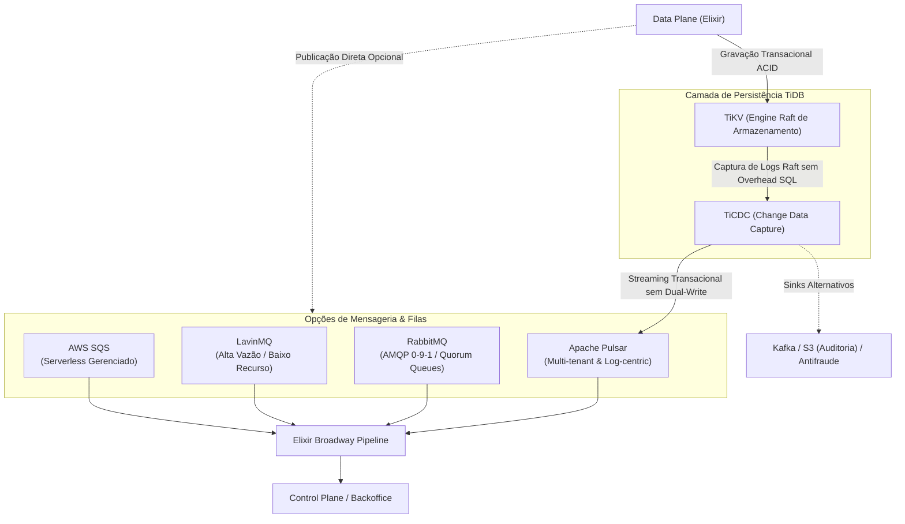
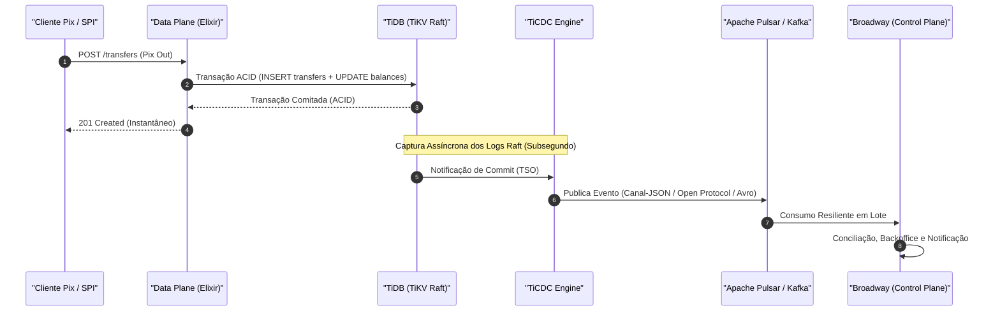
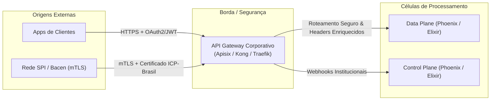

# 04 - Considerações Arquiteturais, Alternativas e Evoluções Futuras

Este documento complementa a [Proposta de Arquitetura](02-proposta-arquitetura.md) e o [Detalhamento Técnico do Cenário 2](03-detalhamento-cenario-2.md), analisando alternativas tecnológicas viáveis, padrões híbridos e decisões estruturais de borda e mensageria para a evolução do sistema.

---

## 1. Arquitetura Híbrida: Utilizando TigerBeetle + TiDB

No detalhamento técnico adotamos o **TiDB** como repositório unificado para ambos os planos, aplicando o padrão contábil e ciclo de vida do TigerBeetle via tabelas relacionais (`ledgers`, `accounts`, `balances`, `transfers`). Contudo, em cenários de hiperescala financeira, uma **arquitetura híbrida utilizando tanto o TigerBeetle nativo quanto o TiDB** oferece vantagens competitivas excepcionais.

### 1.1. Divisão de Responsabilidades no Modelo Híbrido

| Componente                           | Mecanismo                                                         | Responsabilidades                                                                                                                                                                                                        |
| :----------------------------------- | :---------------------------------------------------------------- | :----------------------------------------------------------------------------------------------------------------------------------------------------------------------------------------------------------------------- |
| **TigerBeetle (Nativo)**             | Motor contábil especializado (_in-memory_ / NVMe + VSR Consensus) | Executa o caminho crítico de transferências e saldos de clientes com throughput superior a centenas de milhares de TPS e latência inferior a 2ms. Garante a integridade de dupla entrada nativamente no kernel contábil. |
| **TiDB (TiKV - Row Engine)**         | Banco relacional distribuído NewSQL (OLTP)                        | Armazena o catálogo de tenants, regras de negócios complexas, metadados cadastrais, parametrizações do Backoffice e réplica transacional das transferências para auditoria.                                              |
| **TiDB (TiFlash - Columnar Engine)** | Engine analítica em tempo real (OLAP / HTAP)                      | Executa agregações massivas, relatórios regulatórios, conciliações contábeis e alimenta os dashboards do Backoffice sem competir por recursos com a escrita.                                                             |

### 1.2. Replicação de Transações e Uso da Engine Analítica do TiDB (TiFlash)

O grande benefício dessa arquitetura é unir a velocidade transacional do TigerBeetle com a capacidade analítica avançada do TiDB:

1. **Pipeline de Replicação Contínua**:
   - Assim que uma transferência é confirmada no TigerBeetle, o Data Plane ou o próprio TigerBeetle pode enviar um evento para um tópico de mensageria.
   - Um pipeline em **Elixir Broadway** consome esses eventos em lotes (_micro-batches_) e realiza inserções em lote idempotentes (`INSERT IGNORE` / `ON DUPLICATE KEY UPDATE`) nas tabelas `transfers` e `balances` espelhadas no TiDB.

2. **Ativação da Engine Analítica (TiFlash)**:
   - No TiDB, basta habilitar réplicas colunares nas tabelas de transferências e saldos:
     ```sql
     ALTER TABLE transfers SET TIFLASH REPLICA 1;
     ALTER TABLE balances SET TIFLASH REPLICA 1;
     ```
   - O próprio cluster TiDB gerencia a sincronização colunar contínua via protocolo Raft Learner com latência de replicação subsegundo, **sem impacto de I/O na engine relacional TiKV**.

3. **Dashboards e Relatórios de Backoffice de Alto Desempenho**:
   - **Agregações em Tempo Real**: O otimizador de custos do TiDB direciona automaticamente consultas pesadas (como `SUM(amount)`, `GROUP BY transfer_code`, médias móveis de volume Pix por minuto/hora) para a engine **TiFlash**.
   - **Isolamento de Carga**: Consultas analíticas pesadas disparadas pelo time financeiro ou por ferramentas de BI (Metabase, Grafana) não degradam as operações relacionais do Control Plane.
   - **Enriquecimento Relacional**: Permite cruzar transações brutas de alta velocidade com tabelas ricas em metadados relacionais (dados cadastrais do cliente, parâmetros de compliance, histórico de tickets e regras de negócio).

### 1.3. Vantagens da Combinação

- **Desempenho Extremo no Pix**: O TigerBeetle foi construído especificamente para contabilidade financeira de alto volume com tolerância a falhas determinística (algoritmo _Viewstamped Replication_ e protocolo LMAX-like), eliminando o custo de tradução relacional em operações de débito e crédito no caminho crítico.
- **Poder Analítico sem ETL Externo**: Elimina a necessidade de pipelines lentos e complexos de ETL para Data Warehouses (como Snowflake ou BigQuery) para obter relatórios operacionais do mesmo dia, já que o TiFlash atua como um data mart colunar em tempo real.

### 1.4. Trade-offs e Cuidados de Engenharia

- **Consistência Eventual na Camada Analítica**: As consultas analíticas no TiFlash refletirão os dados com uma defasagem mínima (geralmente centenas de milissegundos) em relação ao estado imediato do TigerBeetle.
- **Idempotência no Replicador**: O consumidor Broadway deve lidar rigorosamente com duplicações de rede através do `id` único da transferência gerado originalmente.
- **Custo Operacional**: Requer dimensionamento de nós dedicados de TiFlash (com armazenamento SSD/NVMe) no cluster TiDB, além dos nós de TiKV e do cluster TigerBeetle.

---

## 2. Alternativas de Mensageria e Ingestão de Eventos: RabbitMQ, LavinMQ, AWS SQS e TiCDC

A escolha do **Apache Pulsar** no Cenário 2 foi pautada pelo seu suporte nativo a **Multi-Tenancy**, desacoplamento entre computação e armazenamento (BookKeeper) e capacidade de atuar tanto como fila (_queuing_) quanto como log de eventos (_event streaming_). 

No entanto, dependendo do contexto de infraestrutura, custo operacional e requisitos de consistência transacional, outras soluções de mensageria tradicionais (RabbitMQ, LavinMQ, AWS SQS) e abordagens arquiteturais baseadas em captura de dados de transações (**TiCDC**) podem ser adotadas como alternativas ou complementos estratégicos:



### 2.1. Comparativo Detalhado de Brokers de Mensageria

| Critério                     | Apache Pulsar                                      | RabbitMQ                                        | LavinMQ                                                | AWS SQS (FIFO)                            |
| :--------------------------- | :------------------------------------------------- | :---------------------------------------------- | :----------------------------------------------------- | :---------------------------------------- |
| **Suporte a Multi-Tenancy**  | **Nativo de 1ª classe** (`tenant/namespace/topic`) | Lógico via _vhosts_ ou usuários                 | Lógico via _vhosts_                                    | Apenas por criação de filas separadas     |
| **Modelo de Mensagens**      | Híbrido (Streaming Log + Queuing)                  | Message Broker Tradicional (AMQP)               | Message Broker Tradicional (AMQP)                      | Queue Service (Pull-based)                |
| **Retenção e Replay**        | **Sim** (política de retenção infinita ou por TTL) | Limitado (mensagens são descartadas após ack)   | Limitado (descarte após ack)                           | Até 14 dias (sem replay arbitrário)       |
| **Integração com Elixir**    | Boa (broadway_pulsar / Erlang client)              | **Excelente** (BroadwayRabbitMQ nativo oficial) | **Excelente** (100% compatível com AMQP 0-9-1)         | **Excelente** (BroadwaySQS oficial)       |
| **Complexidade Operacional** | Alta (requer ZooKeeper/BookKeeper e Brokers)       | Média (cluster Erlang com Raft/Quorum Queues)   | **Baixa** (binário único em Crystal, sem dependências) | **Nula** (Totalmente gerenciado pela AWS) |
| **Ordenação Concorrente**    | `Key_Shared` por `account_id`                      | `Single Active Consumer` ou hashing exchange    | `Single Active Consumer` ou hashing exchange           | `MessageGroupId`                          |

### 2.2. Quando Adotar as Alternativas de Filas?

1. **Adotar RabbitMQ**:
   - **Cenário**: Se a equipe já possui domínio consolidado sobre o ecossistema Erlang/Elixir e RabbitMQ, utilizando **Quorum Queues** (baseadas em Raft) para alta disponibilidade.
   - **Trade-off**: Como o RabbitMQ descarta mensagens após o _ack_, a persistência histórica de eventos para auditoria precisará ser feita obrigatoriamente no banco de dados.

2. **Adotar LavinMQ**:
   - **Cenário**: Se o objetivo for reduzir custos de infraestrutura e complexidade operacional em estágios iniciais ou médios. O LavinMQ consome uma fração ínfima de memória RAM e CPU em relação ao RabbitMQ e Pulsar, entregando centenas de milhares de mensagens por segundo com compatibilidade total ao protocolo AMQP 0-9-1.
   - **Trade-off**: Menor maturidade de mercado institucional e ausência de provedores gerenciados em larga escala.

3. **Adotar AWS SQS (FIFO)**:
   - **Cenário**: Se a arquitetura for 100% hospedada na AWS e a equipe priorizar zero manutenção de infraestrutura de mensageria (_serverless_).
   - **Trade-off**: O SQS FIFO impõe custos adicionais por milhão de requisições e latência ligeiramente superior (polling HTTP em vez de conexões TCP streaming persistentes).

### 2.3. TiCDC (TiDB Change Data Capture): Streaming Direto do Banco sem Dual-Write

O **TiCDC** é uma ferramenta nativa do ecossistema TiDB projetada para replicar dados incrementais de mutação diretamente a partir dos logs de consenso Raft dos nós **TiKV**, sem passar pela camada de computação SQL (`tidb-server`) e sem impor carga sobre a CPU da aplicação.

#### 1. Resolução do "Dual-Write Problem" no Fluxo Pix

Em arquiteturas orientadas a eventos tradicionais, a aplicação (Data Plane) precisa realizar duas operações de escrita:
1. Comitar a transação financeira no banco relacional (TiDB).
2. Publicar o evento de liquidação na mensageria (Pulsar/RabbitMQ).

Esse padrão sofre do **Dual-Write Problem**: se a escrita no banco for bem-sucedida mas o envio para o broker falhar (por timeout de rede, partition ou throttling), o sistema entra em estado inconsistente, exigindo transações distribuídas (2PC) ou tabelas de Outbox manuais com _polling_ contínuo.

Com o **TiCDC**, o fluxo é simplificado para um modelo **Transactional Outbox Nativo**:
- O Data Plane realiza **apenas uma transação ACID local no TiDB**.
- O cluster TiCDC monitora os nós TiKV, captura as alterações confirmadas pelo quórum Raft com base no **TSO (Timestamp Oracle)** global do PD e publica os eventos de forma assíncrona no Apache Pulsar ou Apache Kafka.
- **Resultado**: O caminho crítico HTTP do Pix fica 100% isolado de instabilidades da camada de mensageria, com latência de resposta ao cliente reduzida e garantia matemática de que nenhum evento confirmado será perdido.



#### 2. Protocolos e Sinks Suportados pelo TiCDC

O TiCDC oferece suporte nativo a múltiplos destinos de entrega (_sinks_), permitindo desacoplar diferentes consumidores conforme a necessidade:

| Sink de Destino                   | Formatos de Dados                          | Casos de Uso na Arquitetura                                                                               |
| :-------------------------------- | :----------------------------------------- | :-------------------------------------------------------------------------------------------------------- |
| **Apache Pulsar / Apache Kafka**  | Open Protocol, Canal-JSON, Avro, Debezium  | Alimenta os pipelines de conciliação do Control Plane, motores de antifraude e notificação de clientes.   |
| **Object Storage (AWS S3 / GCS)** | Parquet, CSV                               | _Data Lakehouse_ corporativo, trilha de auditoria contábil imutável e relatórios regulatórios para o Bacen.|
| **MySQL / TiDB Downstream**       | SQL Replicado                              | Réplicas transacionais somente-leitura em regiões secundárias para contingência operacional (_DR_).       |

#### 3. Vantagens do TiCDC

- **Zero Sobrecarga no Caminho Crítico**: O Data Plane não precisa manter conexões com brokers de fila nem aguardar confirmações de envio de rede durante a execução do Pix.
- **Ordenação Transacional Rigorosa**: Ao contrário de filas tradicionais onde requisições paralelas podem publicar mensagens fora de ordem, o TiCDC preserva a ordem cronológica estrita das transações baseando-se no `commit_ts` do TiDB.
- **Resiliência a Quedas do Broker**: Se o cluster Pulsar ou Kafka ficar indisponível, o TiCDC retém a posição de replicação (_checkpoint watermark_) no TiKV e retoma a transmissão automaticamente após a recuperação, sem interromper o processamento de pagamentos.
- **Filtros e Roteamento Granular**: Permite rotear tabelas específicas (ex.: apenas `transfers` e `outbox_events`) para tópicos dedicados, ignorando tabelas temporárias ou internas.

#### 4. Trade-offs e Cuidados de Engenharia

- **Semântica At-Least-Once**: O TiCDC garante entrega de eventos com política _ao menos uma vez_. Em cenários de troca de líder ou reconexão de nós TiCDC, eventos duplicados podem ser reenviados, exigindo que os consumidores Broadway utilizem chaves de idempotência (`transfer_id` ou `txid`).
- **Infraestrutura Dedicada**: O TiCDC requer instâncias de nós próprias (mínimo de 2 ou 3 nós para alta disponibilidade) monitoradas pelo PD do TiDB, com dimensionamento adequado de memória e largura de banda de rede.
- **Monitoramento de Replicação**: É fundamental monitorar as métricas de `checkpoint_ts` e `resolved_ts` via Prometheus/Grafana para alertar caso haja acúmulo de _lag_ de replicação sob picos extremos de tráfego.

---

## 3. Adoção de um API Gateway na Borda

No Cenário 2, as requisições Pix de clientes e webhooks chegam diretamente aos nós de Data Plane (Servidores HTTP Phoenix). A introdução de um **API Gateway corporativo** na borda traz ganhos substanciais de segurança, resiliência e conformidade regulatória:



### 3.1. Responsabilidades Chave do API Gateway

1. **Terminação de mTLS e Certificados do Bacen**:
   - A rede Pix (SPI) exige autenticação mTLS utilizando certificados digitais da cadeia **ICP-Brasil (SPB)**.
   - O API Gateway pode assumir a validação estrita dos certificados e a terminação TLS, repassando para o Data Plane apenas conexões limpas e com headers de autenticação verificados, reduzindo o processamento criptográfico na camada de aplicação.

2. **Rate Limiting e Proteção Contra Abusos (Por Tenant)**:
   - Aplicação de limites de vazão por IP e por `tenant_id` (ex.: _Token Bucket_ ou _Leaky Bucket_).
   - Impede que um cliente corporativo emita milhares de requisições de Pix simultâneas e monopolize os recursos de processamento dos demais clientes.

3. **Roteamento Dinâmico Multitenant**:
   - O Gateway inspeciona o token JWT ou o header `X-Tenant-ID` e encaminha a requisição diretamente para o pool de instâncias de Data Plane mais adequado, permitindo isolamento físico (_tenant sharding_) quando necessário.

4. **Observabilidade e Tracing Distribuído**:
   - Injeção automática de `traceparent` (padrão W3C / OpenTelemetry) e geração de IDs de correlação para rastreabilidade de ponta a ponta desde a borda até o TiDB e Pulsar.

---

## Documentos Relacionados

- [01 - Mini-Desafio Original](01-mini-desafio.md)
- [02 - Proposta de Arquitetura em Alto Nível](02-proposta-arquitetura.md)
- [03 - Detalhamento Técnico do Cenário 2 (Data Plane vs Control Plane)](03-detalhamento-cenario-2.md)
- [Modelagem DDL do Banco de Dados (schema.sql)](schema.sql)
- [Especificação OpenAPI do Data Plane (openapi-data-plane.yaml)](openapi-data-plane.yaml)
